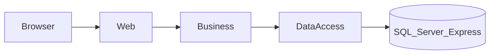
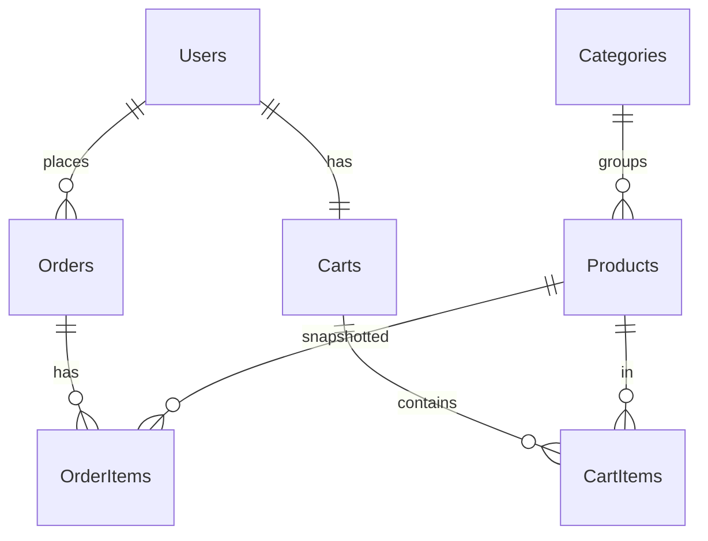

# Mini B2B E-Ticaret Portalı — Geliştirme Planı

Küçük ölçekli B2B e-ticaret uygulaması. Amaç: ürün, kullanıcı, katalog, sepet, sipariş, stok ve sipariş durumu süreçlerini uçtan uca uygulamak.

Çalışma biçimi: **parça parça**. Her faz bitince durulur; sonraki faza geçilmeden önce onay alınır.

---

## 1. Teknoloji ve mimari

| Katman | Tercih | Gerekçe |
| --- | --- | --- |
| Uygulama | ASP.NET Core MVC (Razor) | Ayrı frontend yok; teslimde tarayıcıda hemen gösterilir |
| Mimari | N-Tier (katmanlı) | Domain / Data / Business / Web ayrımı |
| ORM | Entity Framework Core | Code-first, migration + SQL script |
| Veritabanı | SQL Server Express (`.\SQLEXPRESS`) | Ödev zorunluluğu |
| Kimlik | Cookie authentication + roller | Admin / Customer |
| Şifre | BCrypt hash | Açık metin tutulmaz |
| Arama / filtre | SQL tarafında (`IQueryable`) | Tüm kayıtları belleğe çekip filtreleme yok |

### 1.1. Çözüm yapısı

```
MiniB2BPortal/
├── src/
│   ├── MiniB2B.Domain        # Entity, enum
│   ├── MiniB2B.DataAccess    # EF Core, DbContext, ilişkiler, repository
│   ├── MiniB2B.Business      # İş kuralları, DTO, validasyon, servisler
│   └── MiniB2B.Web           # MVC: bayi arayüzü + Areas/Admin
├── database/                 # Teslim için SQL script
├── GELISTIRME-PLANI.md       # Bu dosya
└── README.md                 # Kurulum ve çalıştırma (son fazda tamamlanır)
```

### 1.2. Katman akışı



- **Domain:** yalnızca varlıklar ve enum’lar
- **DataAccess:** tablolar, PK/FK/unique/index, repository
- **Business:** stok, sipariş snapshot, şifre hash, validasyon
- **Web:** ekranlar, auth cookie, dosya yükleme; iş kuralı yok

---

## 2. İki ana bölüm

1. **Kullanıcı arayüzü (bayi):** kayıt/giriş, ana sayfa, ürün grid, arama, detay popup, sepet, sipariş, siparişlerim
2. **Yönetim paneli:** ürün, kullanıcı, sipariş, slider, grid kolon ayarı

Giriş yapmamış kullanıcı katalog / sepet / sipariş göremez. Admin sayfaları yalnızca `Admin` rolüne açıktır.

---

## 3. Veritabanı

Ödevdeki minimum tablolar + iki ek tablo (dinamik grid ve ana sayfa slider).

| Tablo | Rol |
| --- | --- |
| `Users` | Ad, soyad, e-posta, telefon, kullanıcı adı, şifre hash, rol |
| `Categories` | Ürün grupları |
| `Products` | Kod, ad, açıklama, marka, üretici kodu, özel kod 1–2, resim, stok, kritik stok, fiyat |
| `Carts` | Kullanıcı başına bir sepet |
| `CartItems` | Sepet kalemi (aynı ürün birleşir) |
| `Orders` | Sipariş no, kullanıcı, tarih, durum, toplam |
| `OrderItems` | Sipariş anındaki ürün kodu, ad, adet, birim fiyat, satır tutarı |
| `ProductGridColumns` | Hangi kolon, sıra, render tipi, genişlik, cihaz görünürlüğü |
| `Sliders` | Ana sayfa kampanya / duyuru banner’ı |

### 3.1. İlişkiler



Dikkat edilecekler:

- Primary key, foreign key, unique (e-posta, kullanıcı adı, ürün kodu, sipariş no)
- Null / not null ve doğru veri tipleri (`decimal(18,2)` fiyat, `int` stok)
- Sipariş kaleminde fiyat **kopyalanır**; ürün fiyatı sonra değişse eski sipariş aynı kalır

### 3.2. Sipariş durumları

| Değer | Anlam |
| --- | --- |
| `Pending` | Yeni sipariş (beklemede) |
| `Approved` | Onaylandı |
| `Rejected` | Reddedildi |

Yönetici Onaylandı / Reddedildi yapar; bayi **Siparişlerim** ekranında görür.

### 3.3. Stok göstergesi (grid)

Kritik seviye **ürün bazında** (`CriticalStockLevel`):

| Koşul | Gösterge |
| --- | --- |
| Stok > kritik | Var (yeşil) |
| 0 < stok ≤ kritik | Kritik (sarı) |
| Stok ≤ 0 | Yok (kırmızı) |

### 3.4. Dinamik grid kolonları

`ProductGridColumns` üzerinden, kod değiştirmeden:

- Hangi alan gösterilecek (`FieldName` → ürün property, reflection)
- Sıra, başlık, genişlik, hizalama
- Render tipi: metin, görsel, stok rozeti, para, adet kutusu, sepete ekle
- Masaüstü / tablet / telefon görünürlüğü

---

## 4. İş kuralları (özet)

- Şifre veritabanında hash; düz metin yok
- Zorunlu alan, geçersiz fiyat, negatif stok kabul edilmez
- Olmayan / pasif ürün sepete eklenemez
- Sepette aynı ürün varsa adet birleşir
- Sipariş öncesi stok **backend’de** kontrol edilir
- Yetersiz stokta sipariş oluşmaz: *“Ürün A için yeterli stok bulunmamaktadır. Mevcut stok: 5.”*
- Yeterli stokta: sipariş + kalem snapshot, stok düşer, sepet temizlenir
- Arama SQL’de metin/kod kolonlarında (ad, kod, marka, üretici kodu, açıklama, özel kodlar); sayısal alanlar (stok, fiyat) aramaya dahil değil

---

## 5. Varsayılan kullanıcılar (seed)

| Rol | Kullanıcı adı | Şifre | E-posta |
| --- | --- | --- | --- |
| Admin | `admin` | `Admin123!` | admin@minib2b.com |
| Bayi | `bayi` | `Bayi123!` | bayi@ornek.com |

---

## 6. Geliştirme fazları

Her faz: kodla → derle → (gerekirse tarayıcıda bak) → dur → onay bekle.

### Faz 0 — Temizlik

Yarım kodu kaldır; boş, derlenen N-Tier çözüm + `.gitignore`.

**Bitiş:** `dotnet build` geçer; henüz iş kuralı ve ekran yok.

### Faz 1 — Veritabanı ve iskelet

Entity’ler, `AppDbContext` (PK/FK/unique/index), migration veya SQL script, seed (admin, bayi, kategoriler, örnek ürünler, grid kolonları, slider).

**Durma noktası:** SQL Express’te `MiniB2BPortal` oluşur; tablolar ve örnek veri görünür. Ekran yok.

### Faz 2 — Kayıt, giriş, yetki

Kayıt / giriş / çıkış, BCrypt, cookie auth. Girişsiz korumalı sayfalar kapalı. Admin alanı `Admin` rolü.

**Durma noktası:** `admin / Admin123!` ve `bayi / Bayi123!` ile giriş.

### Faz 3 — Admin: ürün ve kullanıcı

Ürün listeleme, arama, ekleme, düzenleme (görsel, stok, kritik stok, fiyat validasyonu). Kullanıcı liste / detay / düzenle (şifre verilirse yeniden hash).

**Durma noktası:** Yönetici ürün ekler, kullanıcıyı günceller.

### Faz 4 — Bayi katalog (dinamik grid)

Ana sayfa + slider. Ürün listesi tablo/grid. Kolonlar veritabanından. Arama SQL’de. Ürün detayı popup. Satırdan adet + sepete ekle.

**Durma noktası:** Detay sayfasına girmeden sepete ekleme ve popup detay çalışır.

### Faz 5 — Sepet

Ürün, birim fiyat, adet, satır tutarı, sepet toplamı. Adet güncelle, ürün sil. Aynı ürün birleşir.

**Durma noktası:** Sepet tutarlı; stok üstü adet uyarılır.

### Faz 6 — Sipariş ve stok

“Sipariş Oluştur”: backend stok kontrolü, snapshot, stok düşümü, sepet temizliği. **Siparişlerim** listesi ve detay.

**Durma noktası:** Yetersiz stokta sipariş oluşmaz; yeterli stokta sipariş ve stok güncellenir.

### Faz 7 — Admin sipariş

Liste: sipariş no, kullanıcı, tarih, tutar, durum. Detay: kod, ad, adet, birim fiyat, satır tutarı. Durum Onaylandı / Reddedildi. Bayi ekranına yansır.

**Durma noktası:** Admin durum değiştirir; bayi Siparişlerim’de görür.

### Faz 8 — Teslim cilası

- Slider yönetimi (admin)
- Grid kolon ayarı (kod değiştirmeden)
- `database/` SQL script
- README: kurulum, connection string, varsayılan kullanıcılar, teknolojiler, mimari
- Validasyon ve anlaşılır hata mesajları
- Uçtan uca tarayıcı kontrolü

**Durma noktası:** Proje çalışır ve teslime hazırdır.

---

## 7. Faz kontrol listesi

| Faz | Konu | Durum |
| --- | --- | --- |
| 0 | Temizlik ve boş iskelet | Tamamlandı |
| 1 | Veritabanı, entity, seed | Tamamlandı |
| 2 | Kayıt / giriş / yetki | Tamamlandı |
| 3 | Admin ürün ve kullanıcı | Tamamlandı |
| 4 | Dinamik grid, arama, popup | Bekliyor |
| 5 | Sepet | Bekliyor |
| 6 | Sipariş, stok, siparişlerim | Bekliyor |
| 7 | Admin sipariş durumu | Bekliyor |
| 8 | README, SQL, slider/grid, doğrulama | Bekliyor |

---

## 8. Teslim çıktıları (ödev maddesi 15)

1. Kaynak kod
2. Veritabanı oluşturma scripti veya migration
3. README (kurulum, bağlantı, çalıştırma, varsayılan kullanıcılar)
4. Kullanılan teknolojiler
5. Mimari / teknik tercihlerin kısa açıklaması

Bu plan dosyası mimari ve faz kararlarını belgeler; README pratik çalıştırma bilgilerini içerir.
